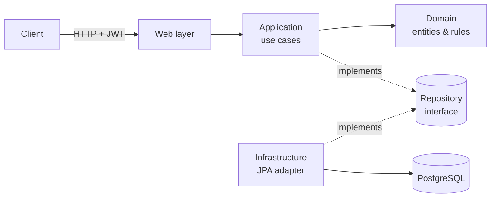
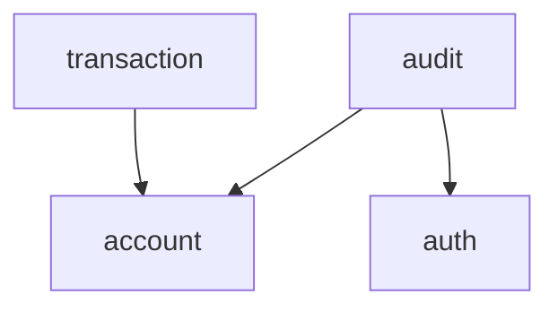

# Banking Core API

A backend banking system built with **Java 21 + Spring Boot**, designed as a
**Modular Monolith** with **Clean Architecture** internals. Built as a
portfolio project to demonstrate backend design, not to accumulate
technologies for their own sake — every architectural decision below has a
reason attached to it.

## Table of contents

- [Objective](#objective)
- [Architecture](#architecture)
- [Modules](#modules)
- [Domain rules](#domain-rules)
- [Security](#security)
- [Observability](#observability)
- [Tech stack](#tech-stack)
- [API](#api)
- [Configuration](#configuration)
- [Running it](#running-it)
- [Frontend](#frontend)
- [Testing](#testing)
- [CI](#ci)
- [Design decisions & known trade-offs](#design-decisions--known-trade-offs)
- [4+1 architectural views](docs/4+1-views.md)

## Objective

Manage users, authentication, multiple accounts per user, and the financial
operations on those accounts — deposits, withdrawals, transfers, account
lifecycle — with an audit trail, all behind a JWT-secured REST API.

## Architecture

**Modular Monolith + Clean Architecture.** A single Spring Boot deployable,
internally organized by *business module* rather than by technical layer
(no project-wide `controller/`, `service/`, `repository/` packages) —
each module owns its own layers instead:

```text
module/
├── domain/          entities, value objects, business rules, repository
│                    interfaces — no Spring, no JPA, no HTTP
├── application/     use cases; orchestrate the domain, depend on
│                    abstractions (repository/publisher interfaces)
├── infrastructure/  JPA entities, mappers, repository implementations,
│                    security adapters, event listeners
└── web/             REST controllers and DTOs — no business logic
```

The domain layer is deliberately framework-free (**"Option B"**): `Account`,
`User`, `Transaction` and `AuditLog` are plain Java classes, never `@Entity`.
Each has a JPA counterpart (`AccountJpaEntity`, etc.) and a `Mapper` that
converts between the two. Swapping JPA for another persistence technology
would only touch the `infrastructure` layer of each module — the domain and
its tests wouldn't change.



### Why modules talk through events, not direct calls

`account`, `transaction` and `audit` need to know about each other's
outcomes (a deposit needs to become a ledger entry and an audit trail
entry), but a direct dependency in every direction would create a cycle.
Instead, `account` publishes domain events
(`AccountMovementEvent`, `AccountLifecycleEvent`) through Spring's
`ApplicationEventPublisher` without knowing who's listening; `transaction`
and `audit` listen for them. The dependency only ever points one way:



`account` never imports anything from `transaction` or `audit` — adding a
fifth module that reacts to account activity wouldn't require touching
`account` at all.

Most listeners run **synchronously, in the same transaction** as the event
that published them — if recording the movement fails, the balance change
that caused it rolls back too, since "it must be recorded" is a hard
requirement, not best-effort. The one exception is the login-attempt
listener in `audit`: since a failed login publishes its event right before
throwing, that listener runs `@TransactionalEventListener(phase =
AFTER_COMPLETION)` in its own transaction, so a failed-login audit entry
survives the rollback of the failed login itself.

## Modules

| Module | Owns |
| --- | --- |
| `auth` | Registration, login, JWT issuance/validation, password hashing |
| `account` | Accounts, balances, deposits/withdrawals, transfers, admin account management |
| `transaction` | The financial ledger — one immutable entry per movement |
| `audit` | A "who did what, when" trail: registrations, logins, account lifecycle changes |
| `shared` | Only what's genuinely cross-cutting: the domain exception hierarchy |
| `config` | Application-wide wiring (Spring Security) that doesn't belong to a single module |

`shared` stays intentionally small — it's not a dumping ground. If a class
belongs to one module's concern, it lives there, not in `shared`.

## Domain rules

**Account** is a real domain object, not an anemic one: the balance only
ever changes through its own behavior (`deposit()`, `withdraw()`), never a
setter.

- States: `ACTIVE`, `BLOCKED`, `CLOSED`.
- A closed account can't operate and can never be reopened.
- A blocked account can't deposit/withdraw/transfer, but *can* still be
  closed (if its balance is zero) — blocking isn't the same as being
  terminal.
- Withdrawing more than the balance fails with `InsufficientFunds`.
- Closing an account with a non-zero balance fails.
- A transfer can't target the same account, and only the source account's
  ownership is checked — the destination can belong to anyone, like a real
  bank transfer.
- `Money` is an immutable value object (fixed 2-decimal scale, never
  negative) instead of a raw `BigDecimal` passed around everywhere.
- Optimistic locking (`@Version` on `AccountJpaEntity`) protects concurrent
  balance mutations — two simultaneous withdrawals on the same account
  can't both succeed and silently overdraw it; the loser gets a `409` and
  is expected to retry.

## Security

- **JWT, stateless.** No server-side session; the token itself (HMAC-signed,
  JJWT) carries the user id, email and role. `JwtAuthenticationFilter`
  validates it on every request and populates Spring Security's context —
  nothing else in the app talks to JWT directly, since the domain and
  application layers depend only on a `TokenProvider` abstraction.
- **Passwords** are hashed with BCrypt, never stored or logged in plain
  text.
- **Authorization is enforced at the route level, not inside domain
  logic.** `/api/admin/**` requires `ROLE_ADMIN` (checked in
  `SecurityConfig`); regular account endpoints check ownership inside the
  domain (`Account.verifyOwnedBy`). The two concerns don't mix — an admin
  endpoint's use case never calls `verifyOwnedBy` at all.
- **There is no public path to create an ADMIN.** Role escalation isn't a
  self-service feature. `AdminUserSeeder` provisions exactly one admin
  account on startup (from `ADMIN_EMAIL`/`ADMIN_PASSWORD`) if none exists
  yet.
- **Login lockout.** `/api/auth/login` tracks failed attempts per email
  (`InMemoryLoginAttemptGuard`) and locks that email out with `429
  TOO_MANY_ATTEMPTS` for a cooldown period after too many failures within a
  window — configurable via `LOGIN_MAX_ATTEMPTS` (default 5),
  `LOGIN_WINDOW_MINUTES` and `LOGIN_LOCKOUT_MINUTES` (default 15 each). A
  locked-out attempt is rejected before the password is even compared,
  including with the *correct* password. This is in-memory and per-instance
  by design (see [Design decisions](#design-decisions--known-trade-offs)) —
  correct for the single-deployable shape this runs in today, not for a
  horizontally-scaled one.
- **Containers run as non-root.** Both the API (`app` user) and the
  frontend (nginx's built-in `nginx` user, via the
  `nginxinc/nginx-unprivileged` base image) drop root inside their
  containers.
- Every 401/403 response — whether from a bad login, a missing token, an
  expired token, or an authorization failure — returns the same
  `{"code": "...", "message": "..."}` shape.

## Observability

Deliberately minimal — this is a single deployable (see the
[4+1 Physical View](docs/4+1-views.md#5-physical-view)), not a distributed
system, so full tracing/metrics infrastructure would be solving a problem
this project doesn't have. What's here is the smallest thing that makes a
production incident debuggable instead of a mystery:

- **Every request gets a correlation id.** `CorrelationIdFilter`
  (`shared.web`) generates one per request, before Spring Security's own
  filter chain even runs, and:
  - returns it in an `X-Request-Id` response header — a caller reporting a
    problem hands back one value instead of a timestamp and a guess;
  - puts it in SLF4J's MDC for the life of the request, so every log line
    for that request — including `GlobalExceptionHandler`'s "Unhandled
    exception" log — can be tied together by grepping one id
    (`logging.pattern.level` in `application.yml` prints it on every line).
- **Unhandled exceptions are logged with a full stack trace** before the
  generic 500 response goes out (`GlobalExceptionHandler`) — the response
  body deliberately stays generic (never leaks the real exception message
  to the client), but the log line + request id together make it
  diagnosable.
- **Actuator, split by audience.** `/actuator/health` (and its
  `/liveness`/`/readiness` sub-paths) is public — the Docker `HEALTHCHECK`
  on both containers, and anything else probing the app, can't
  authenticate. `/actuator/info` and `/actuator/metrics` require `ADMIN`
  (`SecurityConfig`), same as `/api/admin/**` — operational data isn't
  meant for just-any authenticated user.
  - `readiness` isn't just "the JVM booted" — its health group includes the
    `db` indicator (`application.yml`), so it only reports `UP` once the
    app can actually reach Postgres. The Docker `HEALTHCHECK` targets this
    one specifically, not the plain aggregate `/health`.
  - `/actuator/info` returns real build metadata (name, version, build
    time) via the `build-info` Maven goal, not an empty `{}`.
- **Graceful shutdown.** `server.shutdown=graceful` +
  `spring.lifecycle.timeout-per-shutdown-phase=8s` — Tomcat stops taking
  new requests and waits for in-flight ones to finish (up to 8s) instead of
  Docker's `SIGTERM` cutting one off mid-response; 8s stays comfortably
  under Compose's 10s default grace period before it escalates to
  `SIGKILL`.

## Tech stack

**Backend:** Java 21 · Spring Boot 3 · Spring Web · Spring Security ·
Spring Data JPA / Hibernate · Spring Boot Actuator · JJWT · PostgreSQL
(runtime) · H2 (tests only) · Maven · JUnit 5 · Mockito · AssertJ · MockMvc
· PMD · JaCoCo

**Frontend:** React 19 · Vite · react-router-dom · Playwright (agent-driven
end-to-end harness) · nginx (containerized static serving)

**Infra:** Docker · Docker Compose · GitHub Actions

## API

All endpoints except `/api/auth/**` require `Authorization: Bearer <token>`.
`/api/admin/**` additionally requires the `ADMIN` role.

| Method | Path | Description |
| --- | --- | --- |
| POST | `/api/auth/register` | Create a USER account, returns a token |
| POST | `/api/auth/login` | Authenticate, returns a token |
| POST | `/api/accounts` | Open an account for the current user |
| GET | `/api/accounts` | List the current user's accounts |
| GET | `/api/accounts/{id}` | Get one of the current user's accounts |
| POST | `/api/accounts/{id}/deposit` | Deposit into an owned account |
| POST | `/api/accounts/{id}/withdraw` | Withdraw from an owned account |
| POST | `/api/accounts/{id}/transfer` | Transfer to any account |
| POST | `/api/accounts/{id}/close` | Close an owned account (balance must be zero) |
| GET | `/api/accounts/{id}/transactions` | Ledger for an owned account, paginated |
| GET | `/api/admin/accounts` | List every account, paginated *(ADMIN)* |
| GET | `/api/admin/accounts/{id}` | View any account *(ADMIN)* |
| POST | `/api/admin/accounts/{id}/block` | Block any account *(ADMIN)* |
| POST | `/api/admin/accounts/{id}/activate` | Reactivate a blocked account *(ADMIN)* |
| POST | `/api/admin/accounts/{id}/close` | Force-close any account *(ADMIN)* |
| GET | `/api/admin/audit-logs` | Full audit trail, paginated *(ADMIN)* |
| GET | `/actuator/health` (`/liveness`, `/readiness`) | Health check, public, backs the Docker `HEALTHCHECK` |
| GET | `/actuator/info` | Build metadata *(ADMIN)* |
| GET | `/actuator/metrics` | Runtime metrics *(ADMIN)* |

The three "paginated" endpoints above take optional `page` (0-based) and
`size` query params, e.g. `?page=1&size=10`. Omitted, they default to page 0
/ size 20; `size` is silently clamped to 100 regardless of what's requested,
so a client can't force an unbounded response (`shared.paging.PageRequest`).
The frontend consumes this via a small "Load more" pattern
(`hooks/usePaginatedList.js`) on the three corresponding views — no
page-number controls or total count, since the API doesn't return one; a
"Load more" button just appears while there's a next page and disappears
once a page comes back short.

## Configuration

Config lives in `application.yml`, values come from the environment — the
committed file has **no default secrets**, on purpose: even an obvious dev
placeholder reads as a hardcoded credential to anyone (or anything)
scanning the repo. `DB_PASSWORD`, `JWT_SECRET` and `ADMIN_PASSWORD` are
required; the app/container fails fast with a clear message if they're
missing.

Copy [`.env.example`](.env.example) to `.env` and fill in real values:

| Variable | Purpose |
| --- | --- |
| `DB_HOST`, `DB_PORT`, `DB_NAME`, `DB_USER`, `DB_PASSWORD` | PostgreSQL connection |
| `JWT_SECRET` | HMAC signing key (32+ random chars) |
| `JWT_EXPIRATION_SECONDS` | Token lifetime (default 10800 = 3h) |
| `ADMIN_EMAIL`, `ADMIN_PASSWORD` | Seeded once on first startup |
| `LOGIN_MAX_ATTEMPTS`, `LOGIN_WINDOW_MINUTES`, `LOGIN_LOCKOUT_MINUTES` | Login lockout thresholds (defaults 5 / 15 / 15) |
| `APP_PORT` | Host port for the API container (default 8080) |
| `FRONTEND_PORT` | Host port for the frontend container (default 5173) |

## Running it

### Docker Compose (recommended)

```bash
cp .env.example .env   # then fill in real values
docker compose up -d --build
```

This builds and starts all three containers: PostgreSQL, the API
(multi-stage `Dockerfile`), and the frontend (`frontend/Dockerfile`,
static build served by nginx). The API is available at
`http://localhost:8080`, the frontend at `http://localhost:5173`. Each
of the two app containers has a `HEALTHCHECK` (`docker compose ps` shows
`healthy` once ready); the frontend waits on the API's before starting.
Each service also has a memory/CPU limit (`mem_limit`/`cpus` in
`docker-compose.yml`) — generous for a demo, just enough that a runaway
container can't starve the host.

To run only the backend (e.g. while developing the frontend locally with
hot reload instead), omit the `frontend` service:

```bash
docker compose up -d --build app
```

### Locally with Maven

Requires a running PostgreSQL instance and the same environment variables
as above exported in your shell.

```bash
mvn spring-boot:run
```

## Frontend

A small React + Vite demo app in [`frontend/`](frontend/) — enough to see the
API work end to end (register/login, open an account, deposit/withdraw/
transfer, transaction history, and an admin view for the RBAC/audit
endpoints), not a production frontend. State is just React context; no
Redux/Zustand for something this size.

Included in `docker compose up` above (served by nginx from a static
build — see [`frontend/Dockerfile`](frontend/Dockerfile)), or run it
locally with hot reload:

```bash
cd frontend
npm install
npm run dev
```

Runs at `http://localhost:5173` by default and expects the API at
`http://localhost:8080` (override via `VITE_API_BASE_URL`, see
[`frontend/.env.example`](frontend/.env.example) for the dev server, or the
`VITE_API_BASE_URL` build arg in `docker-compose.yml` for the container —
Vite bakes it into the JS at build time either way, not at container start).
The backend's CORS policy (`CorsConfigurationSource` in `SecurityConfig`)
allows `http://localhost:5173` by default — override with
`CORS_ALLOWED_ORIGINS` if the frontend runs somewhere else.

An agent-drivable Playwright harness lives at
[`frontend/.claude/skills/run-frontend/`](frontend/.claude/skills/run-frontend/)
for launching and driving the app end to end (register, create an account,
deposit, check balance/history) without a human at the keyboard.

## Testing

Not built with TDD — tests were written as a deliberate pass over the
critical business rules, not to chase a coverage number.

```bash
mvn test
```

- **Domain unit tests** (`AccountTest`, `MoneyTest`, `UserTest`,
  `TransactionTest`, `AuditLogTest`) — every business rule listed above,
  in isolation, no Spring context.
- **Use case tests** (`TransferMoneyUseCaseTest`, `WithdrawMoneyUseCaseTest`,
  `CloseAccountUseCaseTest`, `GetAccountDetailsUseCaseTest`,
  `ListUserAccountsUseCaseTest`, `JwtTokenProviderTest`) — mocked
  dependencies: every domain exception each use case can throw (not found,
  unauthorized, wrong account state, insufficient funds…), plus
  token-parsing edge cases (expired, tampered, missing claims).
- **`GlobalExceptionHandlerTest`** — every exception category's HTTP
  status/error-code mapping, as a plain unit test (no Spring context
  needed for a POJO `@RestControllerAdvice`); asserts the generic 500
  path never leaks the real exception's message into the response body.
- **`PageRequestTest`** — the page/size normalization and clamping rules
  in isolation (negative page, zero/negative size, oversized size).
- **Integration tests** (`BankingFlowIntegrationTest`,
  `AdminAuthorizationIntegrationTest`, `LoginAttemptGuardIntegrationTest`,
  `GlobalExceptionHandlerIntegrationTest`, `CorrelationIdFilterIntegrationTest`)
  — the full stack through MockMvc (real JWT filter included): register →
  login → accounts → transfers → ledger → RBAC → audit trail → login
  lockout → bean validation failures → unmapped routes →
  `/actuator/health` (+ its `liveness`/`readiness` sub-paths) →
  `/actuator/info`/`/actuator/metrics` requiring `ADMIN` → every response
  carrying a unique `X-Request-Id`, including ones Spring Security rejects
  before reaching a controller.

85 tests, all against H2, so `mvn test` never needs Docker or a real
database. ~98% line coverage as of the last pass — a byproduct of testing
every branch that matters, not a target chased for its own sake; a few
points are deliberately left uncovered (the `main()` bootstrap method,
some JPA-adapter plumbing) where a test would just restate the code.

### Code quality

```bash
mvn verify
```

Runs tests, then two static checks:

- **PMD** ([`pmd-ruleset.xml`](pmd-ruleset.xml)) — code smells, best
  practices and complexity (cyclomatic complexity, excessive class/method
  size, etc.). **This gates the build.** The ruleset is curated, not the
  PMD defaults wholesale: rules that fight this project's deliberate
  architecture (e.g. `DataClass` flagging intentionally-thin JPA
  entities/DTOs) or that are commonly noisy in idiomatic Java (e.g.
  `LawOfDemeter` on ordinary getter chains) are excluded with a reason in
  the ruleset file itself. The handful of remaining one-off exceptions are
  suppressed inline with `// NOPMD` and a comment explaining why, not by
  disabling a rule project-wide.
- **JaCoCo** (`target/site/jacoco/index.html` after running) — coverage,
  **informational only, no minimum threshold**. Consistent with this
  project's testing philosophy above: report it, don't chase a number.
  Currently around 94% line / 80% branch coverage.

Secret scanning runs on every push via GitGuardian. To catch a secret
before it ever leaves your machine instead of after a push, install the
pre-commit hook once: `pip install pre-commit && pre-commit install` (needs
a personal `GITGUARDIAN_API_KEY` — see [`.pre-commit-config.yaml`](.pre-commit-config.yaml)).

## CI

GitHub Actions ([`.github/workflows/ci.yml`](.github/workflows/ci.yml)) runs
on every push/PR to `master`/`develop`: `mvn verify` (build, test, PMD,
coverage) with dependency caching, JUnit results annotated on the run,
coverage commented on PRs, all three reports uploaded as artifacts, and a
separate job that builds the Docker image (layer-cached) to catch
`Dockerfile` regressions. Can also be triggered manually via
`workflow_dispatch`.

## Design decisions & known trade-offs

- **`account` owns transfers, not `transaction`.** A transfer is two
  `Account` operations (withdraw + deposit) orchestrated together — it
  reuses every rule `Account` already enforces instead of duplicating them
  in a separate module.
- **No generic `InvalidTransferException`.** Every invalid-transfer case is
  already covered by a more specific exception (`InsufficientFunds`,
  `AccountClosed`, `AccountBlocked`, `SameAccountTransfer`) — adding an
  unused catch-all class for the sake of a checklist isn't worth the dead
  code.
- **Operation limits (daily caps, etc.) are not implemented.** No real
  variability exists yet to justify a policy/strategy abstraction for it —
  it would be speculative design.
- **IDs are plain `Long`, not value objects.** `AccountId`/`UserId`/
  `TransactionId` were considered but skipped: they'd add a layer of
  wrapping without a behavior difference from a `Long` anywhere in this
  codebase today.
- **Schema managed via `ddl-auto: update`,** not versioned migrations
  (Flyway/Liquibase). Fine for a portfolio project; a real production
  service would want explicit, reviewable migrations instead.
