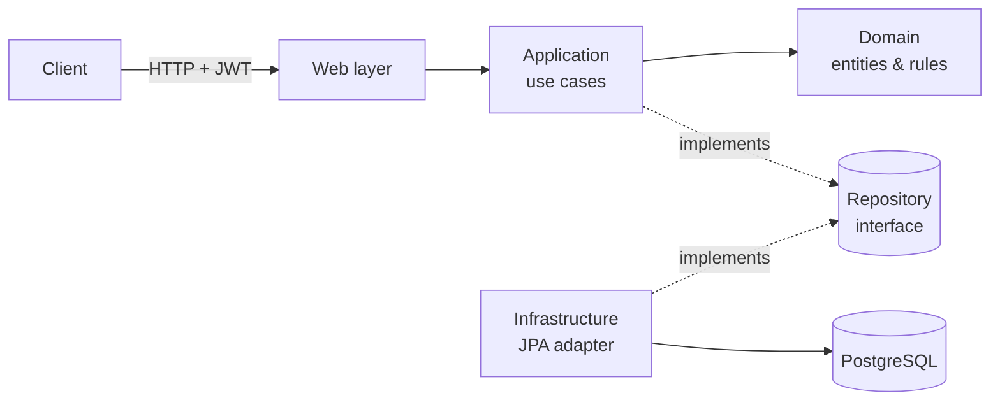
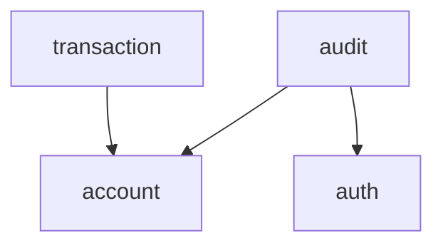

# Banking Core API

A backend banking system built with **Java 21 + Spring Boot**, designed as a
**Modular Monolith** with **Clean Architecture** internals. Built as a
portfolio project to demonstrate backend design, not to accumulate
technologies for their own sake — every architectural decision below has a
reason attached to it.

## Table of contents

- [Objective](#objective)
- [Architecture](#architecture)
- [Modules](#modules)
- [Domain rules](#domain-rules)
- [Security](#security)
- [Tech stack](#tech-stack)
- [API](#api)
- [Configuration](#configuration)
- [Running it](#running-it)
- [Testing](#testing)
- [CI](#ci)
- [Design decisions & known trade-offs](#design-decisions--known-trade-offs)

## Objective

Manage users, authentication, multiple accounts per user, and the financial
operations on those accounts — deposits, withdrawals, transfers, account
lifecycle — with an audit trail, all behind a JWT-secured REST API.

## Architecture

**Modular Monolith + Clean Architecture.** A single Spring Boot deployable,
internally organized by *business module* rather than by technical layer
(no project-wide `controller/`, `service/`, `repository/` packages) —
each module owns its own layers instead:

```
module/
├── domain/          entities, value objects, business rules, repository
│                    interfaces — no Spring, no JPA, no HTTP
├── application/     use cases; orchestrate the domain, depend on
│                    abstractions (repository/publisher interfaces)
├── infrastructure/  JPA entities, mappers, repository implementations,
│                    security adapters, event listeners
└── web/             REST controllers and DTOs — no business logic
```

The domain layer is deliberately framework-free (**"Option B"**): `Account`,
`User`, `Transaction` and `AuditLog` are plain Java classes, never `@Entity`.
Each has a JPA counterpart (`AccountJpaEntity`, etc.) and a `Mapper` that
converts between the two. Swapping JPA for another persistence technology
would only touch the `infrastructure` layer of each module — the domain and
its tests wouldn't change.



### Why modules talk through events, not direct calls

`account`, `transaction` and `audit` need to know about each other's
outcomes (a deposit needs to become a ledger entry and an audit trail
entry), but a direct dependency in every direction would create a cycle.
Instead, `account` publishes domain events
(`AccountMovementEvent`, `AccountLifecycleEvent`) through Spring's
`ApplicationEventPublisher` without knowing who's listening; `transaction`
and `audit` listen for them. The dependency only ever points one way:



`account` never imports anything from `transaction` or `audit` — adding a
fifth module that reacts to account activity wouldn't require touching
`account` at all.

Most listeners run **synchronously, in the same transaction** as the event
that published them — if recording the movement fails, the balance change
that caused it rolls back too, since "it must be recorded" is a hard
requirement, not best-effort. The one exception is the login-attempt
listener in `audit`: since a failed login publishes its event right before
throwing, that listener runs `@TransactionalEventListener(phase =
AFTER_COMPLETION)` in its own transaction, so a failed-login audit entry
survives the rollback of the failed login itself.

## Modules

| Module | Owns |
|---|---|
| `auth` | Registration, login, JWT issuance/validation, password hashing |
| `account` | Accounts, balances, deposits/withdrawals, transfers, admin account management |
| `transaction` | The financial ledger — one immutable entry per movement |
| `audit` | A "who did what, when" trail: registrations, logins, account lifecycle changes |
| `shared` | Only what's genuinely cross-cutting: the domain exception hierarchy |
| `config` | Application-wide wiring (Spring Security) that doesn't belong to a single module |

`shared` stays intentionally small — it's not a dumping ground. If a class
belongs to one module's concern, it lives there, not in `shared`.

## Domain rules

**Account** is a real domain object, not an anemic one: the balance only
ever changes through its own behavior (`deposit()`, `withdraw()`), never a
setter.

- States: `ACTIVE`, `BLOCKED`, `CLOSED`.
- A closed account can't operate and can never be reopened.
- A blocked account can't deposit/withdraw/transfer, but *can* still be
  closed (if its balance is zero) — blocking isn't the same as being
  terminal.
- Withdrawing more than the balance fails with `InsufficientFunds`.
- Closing an account with a non-zero balance fails.
- A transfer can't target the same account, and only the source account's
  ownership is checked — the destination can belong to anyone, like a real
  bank transfer.
- `Money` is an immutable value object (fixed 2-decimal scale, never
  negative) instead of a raw `BigDecimal` passed around everywhere.
- Optimistic locking (`@Version` on `AccountJpaEntity`) protects concurrent
  balance mutations — two simultaneous withdrawals on the same account
  can't both succeed and silently overdraw it; the loser gets a `409` and
  is expected to retry.

## Security

- **JWT, stateless.** No server-side session; the token itself (HMAC-signed,
  JJWT) carries the user id, email and role. `JwtAuthenticationFilter`
  validates it on every request and populates Spring Security's context —
  nothing else in the app talks to JWT directly, since the domain and
  application layers depend only on a `TokenProvider` abstraction.
- **Passwords** are hashed with BCrypt, never stored or logged in plain
  text.
- **Authorization is enforced at the route level, not inside domain
  logic.** `/api/admin/**` requires `ROLE_ADMIN` (checked in
  `SecurityConfig`); regular account endpoints check ownership inside the
  domain (`Account.verifyOwnedBy`). The two concerns don't mix — an admin
  endpoint's use case never calls `verifyOwnedBy` at all.
- **There is no public path to create an ADMIN.** Role escalation isn't a
  self-service feature. `AdminUserSeeder` provisions exactly one admin
  account on startup (from `ADMIN_EMAIL`/`ADMIN_PASSWORD`) if none exists
  yet.
- Every 401/403 response — whether from a bad login, a missing token, an
  expired token, or an authorization failure — returns the same
  `{"code": "...", "message": "..."}` shape.

## Tech stack

Java 21 · Spring Boot 3 · Spring Web · Spring Security · Spring Data JPA /
Hibernate · JJWT · PostgreSQL (runtime) · H2 (tests only) · Maven · Docker /
Docker Compose · JUnit 5 · Mockito · AssertJ · MockMvc

## API

All endpoints except `/api/auth/**` require `Authorization: Bearer <token>`.
`/api/admin/**` additionally requires the `ADMIN` role.

| Method | Path | Description |
|---|---|---|
| POST | `/api/auth/register` | Create a USER account, returns a token |
| POST | `/api/auth/login` | Authenticate, returns a token |
| POST | `/api/accounts` | Open an account for the current user |
| GET | `/api/accounts` | List the current user's accounts |
| GET | `/api/accounts/{id}` | Get one of the current user's accounts |
| POST | `/api/accounts/{id}/deposit` | Deposit into an owned account |
| POST | `/api/accounts/{id}/withdraw` | Withdraw from an owned account |
| POST | `/api/accounts/{id}/transfer` | Transfer to any account |
| POST | `/api/accounts/{id}/close` | Close an owned account (balance must be zero) |
| GET | `/api/accounts/{id}/transactions` | Ledger for an owned account |
| GET | `/api/admin/accounts` | List every account *(ADMIN)* |
| GET | `/api/admin/accounts/{id}` | View any account *(ADMIN)* |
| POST | `/api/admin/accounts/{id}/block` | Block any account *(ADMIN)* |
| POST | `/api/admin/accounts/{id}/activate` | Reactivate a blocked account *(ADMIN)* |
| POST | `/api/admin/accounts/{id}/close` | Force-close any account *(ADMIN)* |
| GET | `/api/admin/audit-logs` | Full audit trail *(ADMIN)* |

## Configuration

Config lives in `application.yml`, values come from the environment — the
committed file has **no default secrets**, on purpose: even an obvious dev
placeholder reads as a hardcoded credential to anyone (or anything)
scanning the repo. `DB_PASSWORD`, `JWT_SECRET` and `ADMIN_PASSWORD` are
required; the app/container fails fast with a clear message if they're
missing.

Copy [`.env.example`](.env.example) to `.env` and fill in real values:

| Variable | Purpose |
|---|---|
| `DB_HOST`, `DB_PORT`, `DB_NAME`, `DB_USER`, `DB_PASSWORD` | PostgreSQL connection |
| `JWT_SECRET` | HMAC signing key (32+ random chars) |
| `JWT_EXPIRATION_SECONDS` | Token lifetime (default 10800 = 3h) |
| `ADMIN_EMAIL`, `ADMIN_PASSWORD` | Seeded once on first startup |

## Running it

### Docker Compose (recommended)

```bash
cp .env.example .env   # then fill in real values
docker compose up -d --build
```

This builds the app image (multi-stage `Dockerfile`) and starts it
alongside a PostgreSQL container. The API is available at
`http://localhost:8080`.

### Locally with Maven

Requires a running PostgreSQL instance and the same environment variables
as above exported in your shell.

```bash
mvn spring-boot:run
```

## Testing

Not built with TDD — tests were written as a deliberate pass over the
critical business rules, not to chase a coverage number.

```bash
mvn test
```

- **Domain unit tests** (`AccountTest`, `MoneyTest`, `UserTest`,
  `TransactionTest`, `AuditLogTest`) — every business rule listed above,
  in isolation, no Spring context.
- **Use case tests** (`TransferMoneyUseCaseTest`, `JwtTokenProviderTest`) —
  mocked dependencies, including token-parsing edge cases (expired,
  tampered, missing claims).
- **Integration tests** (`BankingFlowIntegrationTest`,
  `AdminAuthorizationIntegrationTest`) — the full stack through MockMvc
  (real JWT filter included): register → login → accounts → transfers →
  ledger → RBAC → audit trail.

All of it runs against H2, so `mvn test` never needs Docker or a real
database.

## CI

GitHub Actions ([`.github/workflows/ci.yml`](.github/workflows/ci.yml)) runs
on every push/PR to `master`/`develop`: build + test with dependency
caching, JUnit results annotated on the run, and a separate job that
builds the Docker image (layer-cached) to catch `Dockerfile` regressions.
Can also be triggered manually via `workflow_dispatch`.

## Design decisions & known trade-offs

- **`account` owns transfers, not `transaction`.** A transfer is two
  `Account` operations (withdraw + deposit) orchestrated together — it
  reuses every rule `Account` already enforces instead of duplicating them
  in a separate module.
- **No generic `InvalidTransferException`.** Every invalid-transfer case is
  already covered by a more specific exception (`InsufficientFunds`,
  `AccountClosed`, `AccountBlocked`, `SameAccountTransfer`) — adding an
  unused catch-all class for the sake of a checklist isn't worth the dead
  code.
- **Operation limits (daily caps, etc.) are not implemented.** No real
  variability exists yet to justify a policy/strategy abstraction for it —
  it would be speculative design.
- **IDs are plain `Long`, not value objects.** `AccountId`/`UserId`/
  `TransactionId` were considered but skipped: they'd add a layer of
  wrapping without a behavior difference from a `Long` anywhere in this
  codebase today.
- **Schema managed via `ddl-auto: update`,** not versioned migrations
  (Flyway/Liquibase). Fine for a portfolio project; a real production
  service would want explicit, reviewable migrations instead.
