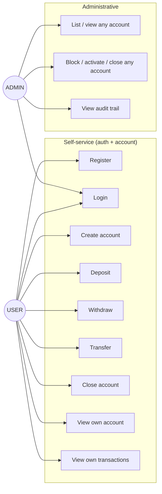
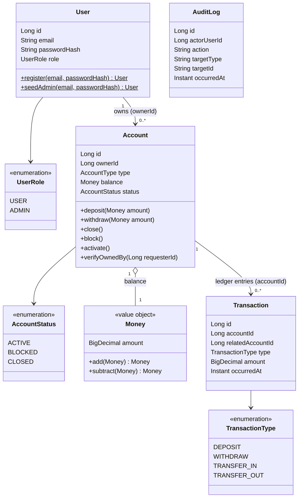
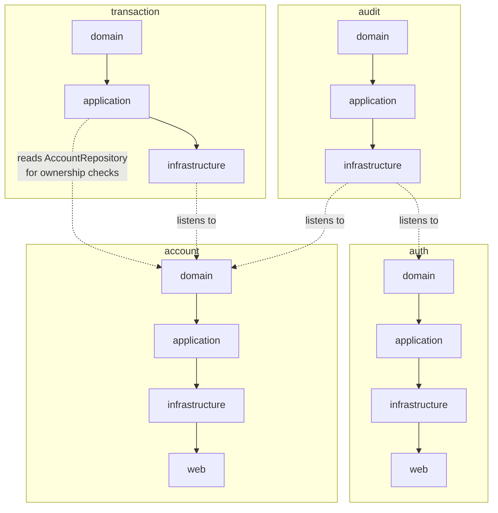
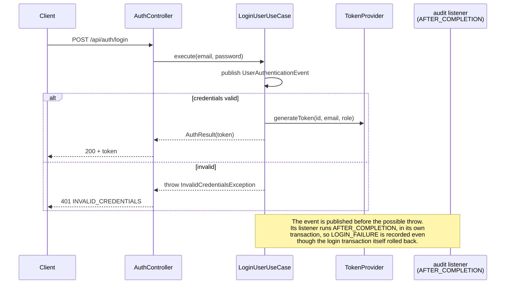
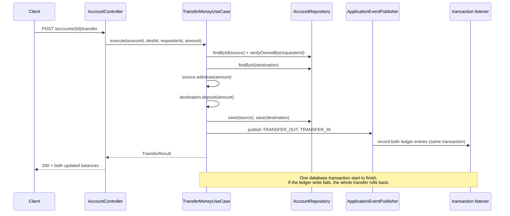
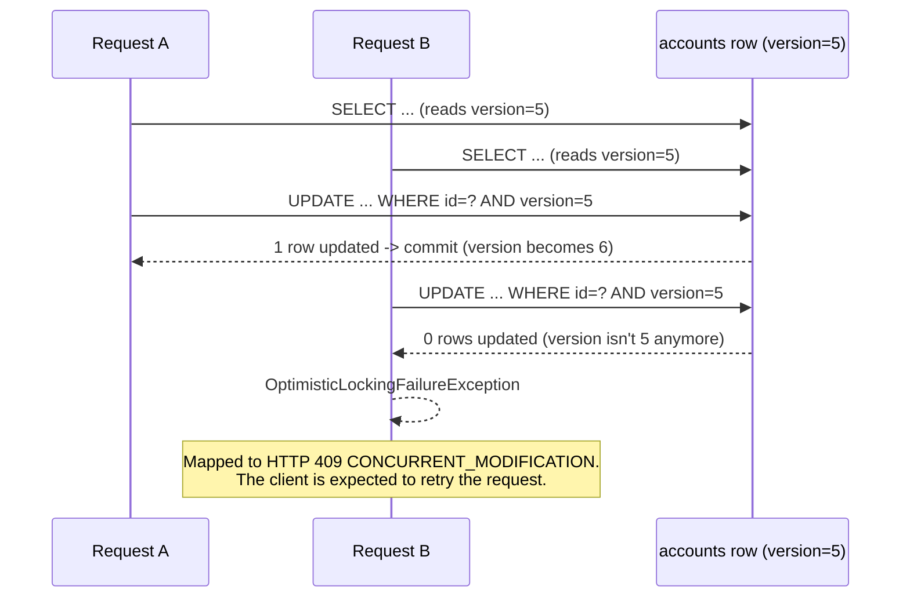
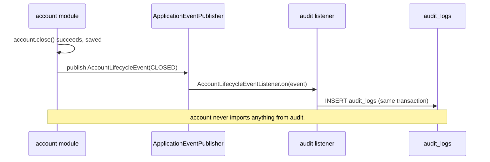
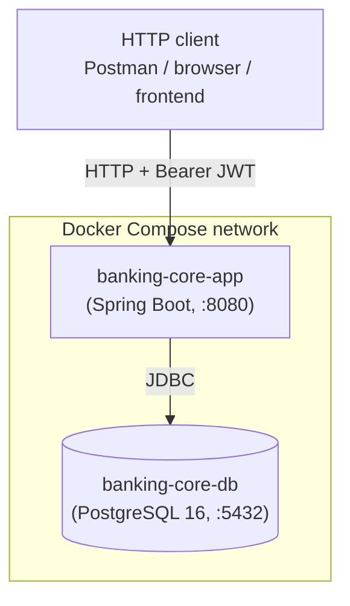

# 4+1 Architectural Views

Kruchten's 4+1 model, documenting this project as it's actually built today
— not an aspirational target. Each view answers a different question about
the same system; together they cover it without any single diagram trying
to show everything at once.

## 1. Use Case View

**Actors:** `USER`, `ADMIN` (see [Security](../README.md#security) for how
a request gets tied to one of these).

`ADMIN` only participates in Login and the administrative group — there's
no self-service path to becoming an admin (see
[`AdminUserSeeder`](../src/main/java/com/bankingcore/auth/infrastructure/AdminUserSeeder.java)).

## 2. Logical View

The domain model. `Money` is a value object, not an entity — it has no
identity of its own, only a value.

`AuditLog` isn't linked by a foreign key to `User`/`Account` in this
diagram on purpose: it references them only by plain id (`actorUserId`,
`targetId`), the same way the `audit` module only ever depends on
`auth`/`account`'s published events, never their entities directly (see
the [Development View](#3-development-view)).

**Value objects considered but not built:** `AccountId`/`UserId`/
`TransactionId` as wrapper types over `Long`, and `Email` as a wrapper
over `String`. Skipped — nothing in this codebase today branches on their
type in a way a plain `Long`/`String` couldn't already do just as safely.

## 3. Development View

Represented by the module boundaries themselves — see the
[Architecture](../README.md#architecture) section for what each layer
inside a module is responsible for. What matters most here is the
*direction* of dependency between modules:

`account` has no dependency arrow pointing *into* `transaction` or
`audit` — it publishes events without knowing who, if anyone, reacts to
them. This is deliberate: it's the Acyclic Dependencies Principle applied
at the module level, and it's what lets `audit` exist as a "sink" module
that nothing else needs to know about.

## 4. Process View

Concurrency and cross-module coordination matter more than any single
class here — the four flows below are the ones worth tracing end to end.

### Login (and why a failed attempt still gets audited)

### Transfer (atomic across two accounts + the ledger)

### Concurrent withdrawals on the same account (optimistic locking)

### Audit trail (one-directional listener, no cycle back to `account`)

## 5. Physical View

Today this is a single deployable talking to a single database instance —
intentionally simple, matching the [Configuration](../README.md#configuration)
and [Running it](../README.md#running-it) sections of the README. The
modular monolith structure (see the [Architecture](../README.md#architecture)
section) is what would let this evolve toward a different physical
topology later — e.g. separate deployables per module behind a gateway —
without a domain-layer rewrite, but that evolution hasn't happened and
isn't claimed here.
